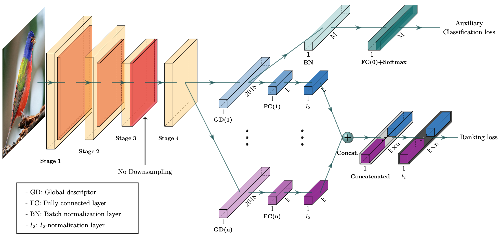

# Histopathology Image Retrieval Project-CGD

 

Welcome to the Histopathology Image Retrieval project! This repository contains code and resources for implementing a deep learning model to perform histopathology image retrieval. The goal of this project is to develop a robust system that can retrieve relevant histopathology images based on user queries. Convolutional models, along with attention mechanisms, are employed to achieve accurate and meaningful image retrieval.

**Note:** This project is based on the research presented in the paper, " Combination of Multiple Global Descriptors for Image Retrieval."


## Table of Contents

- [Project Description](#project-description)
- [Dataset](#dataset)
- [Requirements](#requirements)
- [Usage](#usage)
- [Model Architecture](#model-architecture)

## Project Description

In the Histopathology Image Retrieval project, we tackle the task of retrieving histopathology images based on user-defined queries. Histopathology images play a crucial role in medical diagnosis and research, and efficient retrieval of relevant images can aid in accurate diagnosis and analysis. To achieve this, we have implemented a deep learning model that leverages convolutional neural networks.

## Dataset

This project utilizes the following datasets:

1. **BRACS Dataset**
   - Website: [BRACS Dataset](https://www.bracs.icar.cnr.it/)
   - Description: The BRACS dataset contains a collection of histopathology images for various tissue types. It serves as a valuable resource for training and evaluating our image retrieval model.

2. **CRC Dataset**
   - Website: [CRC Dataset](https://warwick.ac.uk/fac/cross_fac/tia/data/extended_crc_grading/)
   - Description: The CRC dataset offers histopathology images related to colorectal cancer. These images contribute to the diversity of the training data and aid in building a robust retrieval system.

3. **BATCH Dataset**
   - Website: [BATCH Dataset](https://iciar2018-challenge.grand-challenge.org/Dataset/)
   - Description: The BATCH dataset is a part of the ICAR 2018 challenge and consists of histopathology images for various tasks. It provides an additional set of images for validating and testing our retrieval model.

## Requirements
- [Anaconda](https://www.anaconda.com/download/)
- [PyTorch](https://pytorch.org)
```
conda install pytorch torchvision cudatoolkit=10.0 -c pytorch
```
- thop
```
pip install thop
```


## Usage

Follow these steps to run the histopathology image retrieval model:

1. Preprocess the datasets: Implement preprocessing scripts to prepare the datasets for training and evaluation.

2. Train the model: Run training scripts to train the deep learning model using the prepared datasets.

3. Evaluate the model: Use evaluation scripts to assess the performance of the model on the validation and test datasets.

4. Run retrieval: Implement retrieval scripts that take user queries as input and retrieve relevant histopathology images.

## Model Architecture




### Model Parameters and FLOPs (Params | FLOPs)
<table>
  <thead>
    <tr>
      <th>Backbone</th>
      <th>CARS196</th>
      <th>CUB200</th>
      <th>SOP</th>
      <th>In-shop</th>
    </tr>
  </thead>
  <tbody>
    <tr>
      <td align="center">ResNet50</td>
      <td align="center">26.86M | 10.64G</td>
      <td align="center">26.86M | 10.64G</td>
      <td align="center">49.85M | 10.69G</td>
      <td align="center">34.85M | 10.66G</td>
    </tr>
    <tr>
      <td align="center">ResNeXt50</td>
      <td align="center">26.33M | 10.84G</td>
      <td align="center">26.33M | 10.84G</td>
      <td align="center">49.32M | 10.89G</td>
      <td align="center">34.32M | 10.86G</td>
    </tr>
  </tbody>
</table>
